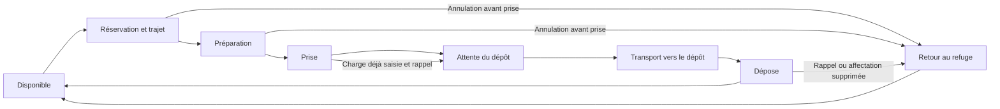

# Lot 06 — Livraisons intégrées à la partie

Première passe validée par le joueur (« ok je valide, tu peux commit et pousser »), après lancement des livraisons dans la partie principale. La scène `scenes/main.tscn` utilise désormais le personnage animé et une tâche de livraison suivie, à la place du transfert instantané de ressources du prototype. Les limites de navigation et les travaux décrits ci-dessous restent à traiter.

## Parcours du joueur

Ouvrir la partie normalement, fonder la colonie, puis cliquer sur une ressource ou ouvrir **Affectations**. **Affecter** confie à un habitant une activité répétée de récolte et de livraison. Les états individuels, les quantités portées et les réservations du gisement sont visibles dans le panneau défilant.

L'habitant réserve une charge, rejoint le point de collecte, prépare les ressources pendant deux secondes, saisit la caisse, revient au dépôt et la dépose. Les réserves de la colonie augmentent au contact de dépose, pas à l'arrivée près du refuge. Le dépôt possède un seul poste de déchargement ; les autres porteurs attendent leur tour.

**Libérer** supprime l'affectation et annule la tâche si la caisse n'a pas encore été prise. Si elle est déjà portée, l'habitant finit de la rapporter avant de redevenir disponible. **H** applique le même principe à tous les habitants, en conservant leurs affectations pour la reprise. Une dépose engagée se termine avant le retour au refuge. Il faut donc rappeler les porteurs assez tôt avant le passage humain.

**Espace** suspend la simulation et les animations. La vitesse du jeu agit sur l'ensemble de la tâche. Les vitesses et capacités de déplacement du prototype sont conservées ; la durée des prises, des déposes et des attentes augmente toutefois le temps d'un aller-retour. L'équilibrage économique devra être réévalué en jouant.

## États et transactions



- `scripts/delivery_ledger.gd` gère les transactions : une tâche par habitant, un poste réservé par gisement, quantité limitée au restant disponible et un seul propriétaire du poste de déchargement.
- La réservation ne retire pas encore les ressources. Le contact de prise à 0,72 s retire la quantité du gisement et libère la quantité réservée ; le poste source reste occupé jusqu'à la fin du redressement. Les appels répétés à la prise ne consomment rien de plus.
- Le contact de dépose à 1,08 s crédite le stock une seule fois. Le poste de déchargement reste occupé jusqu'à la fin du clip à 1,8 s.
- `scripts/worker_delivery.gd` pilote les états et les animations depuis le temps de simulation. La progression des événements est subdivisée en pas de 0,05 s maximum. La marche est synchronisée sur la distance réellement parcourue et la vitesse nominale du clip.
- La même instance de caisse passe du monde au point d'attache du personnage puis revient au monde. À la fin de la dépose, elle est absorbée par la représentation du stock et masquée pour le prochain trajet.
- Les liens entre dictionnaires d'habitants et contrôleurs sont détachés à la fermeture de la scène afin d'éviter les cycles de références.

## Visuels et interface

Les habitants du prototype sont remplacés par le modèle Blender validé, avec repos, marche, portage, prise et dépose. Les textures du personnage sont conservées. La caisse existante est réutilisée comme charge et comme support de collecte/dépôt ; aucun nouveau modèle 3D n'est créé pour ce lot.

La scène principale conserve l'ambiance sous le plancher. Les nouveaux postes de collecte et de déchargement sont exclus des emplacements de construction. Les légendes de ressources et du dépôt sont réduites pour mieux voir les habitants. Le panneau d'affectations défile lorsque la liste s'allonge.

## Vérification reproductible

```powershell
& 'D:\godot\Godot_v4.7.2-stable_win64\Godot_v4.7.2-stable_win64_console.exe' --headless --path . --script res://tests/delivery.gd
& 'D:\godot\Godot_v4.7.2-stable_win64\Godot_v4.7.2-stable_win64_console.exe' --headless --path . --script res://tests/smoke.gd
& 'D:\godot\Godot_v4.7.2-stable_win64\Godot_v4.7.2-stable_win64_console.exe' --path . --script res://tests/delivery_visual.gd
```

Le premier test couvre les réservations concurrentes, un reliquat inférieur à la capacité, l'annulation avant prise, le rappel après prise, les doubles appels de prise/dépose, l'exclusivité du dépôt, la pause des os et du déplacement, la conservation des ressources, de la caisse et le nettoyage des réservations. Le test général conserve la récolte, la construction, le rappel, la victoire et les défaites ; il attend désormais de vraies livraisons pour financer le second abri.

Le contrôle graphique produit quatre captures dans `artifacts/delivery_06/` : prise, transport, dépose et affectations. Pour découvrir immédiatement les livraisons en partie, lancer la scène principale avec `-- --demo-deliveries` : quatre habitants sont affectés automatiquement, sans modifier les ressources de départ ni les règles de survie.

## Limites et prochaine étape

Cette intégration concerne les trajets horizontaux. Les accès verticaux et les pivots à angle fixe validés restent dans la scène de revue ; les trajets libres du prototype peuvent demander n'importe quelle direction. Les rotations à l'arrivée et l'interruption des poses ne disposent pas encore de raccords adaptés à tous les cas.

Les déplacements restent directs, sans recherche de chemin, collision ni évitement des autres habitants et des bâtiments. La file de déchargement garantit l'exclusivité logique du poste, pas un évitement physique. Le réglage de vitesse du prototype peut donner des pas rapides. Le contenu de chaque ressource est encore représenté par la même caisse générique.

Pas de sauvegarde des tâches ni de suppression de gisement/habitant en cours de transport dans cette passe. Prochaine étape : parcours au sol avec obstacles et emplacements d'attente accessibles, puis réservation et traversée des échelles avec les animations validées. Rééquilibrer ensuite vitesses, capacités et besoins sur plusieurs cycles de jeu.
