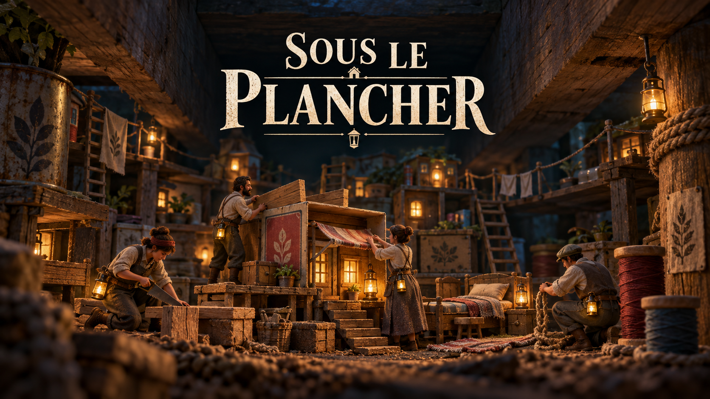
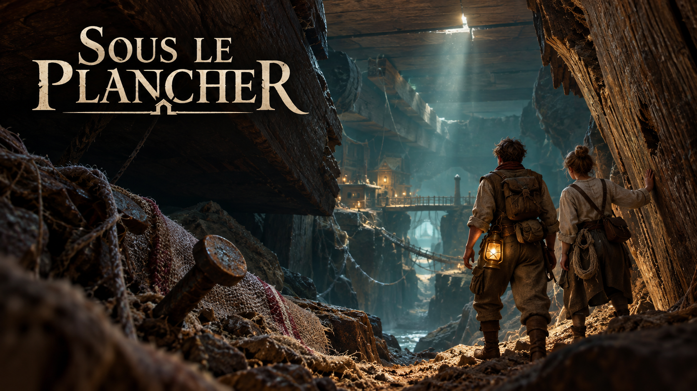
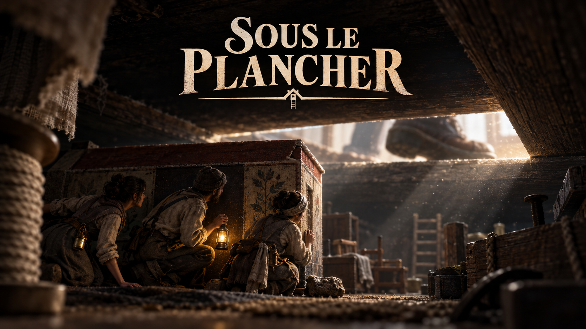
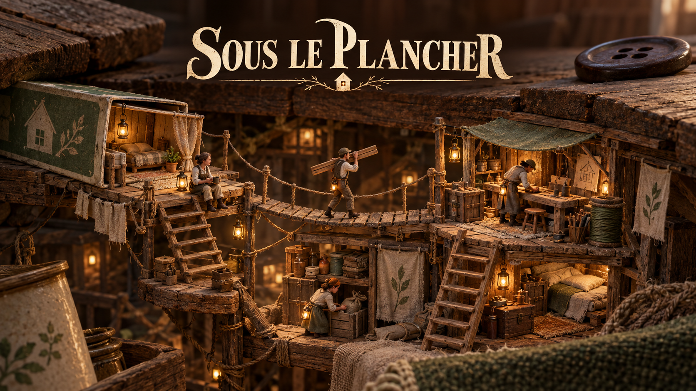
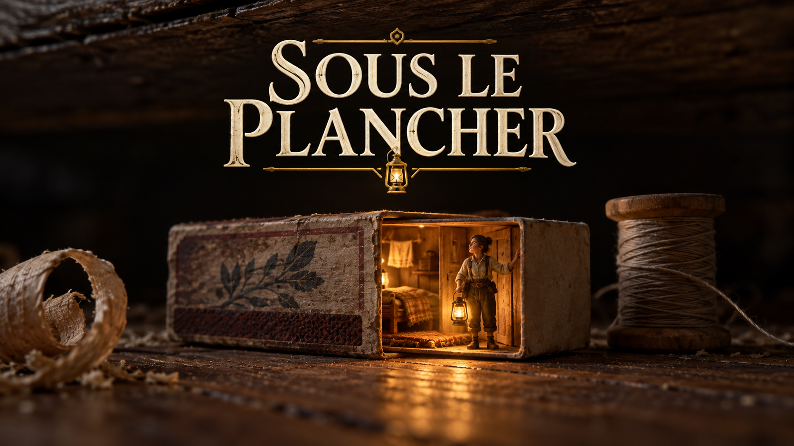

# Splashscreens — cinq propositions

Créés le 28 septembre 2026 avec le générateur d’images intégré. Le modèle « Image 2.5 » demandé n’est pas sélectionnable explicitement via cet outil ; aucune version de modèle n’est attestée ici.

Les cinq propositions ont été retenues pour l’écran de lancement aléatoire. Leurs copies utilisées par le jeu se trouvent dans `assets/ui/splash/`. Les cinq PNG originaux sont conservés sans retouche dans ce dossier.

Ouvrir [la galerie](index.html) pour comparer les propositions.

## 1. Le refuge chaleureux



### Prompt utilisé

```text
Use case: stylized-concept. Asset: professional PC game startup splash screen proposal, single complete landscape 16:9 image, not a collage, no monitor mockup. Game universe: Sous le plancher, a colony survival management game about tiny adult human craftspeople living beneath the floorboards of an ordinary house. Grounded handmade miniature world, salvaged matchbox furniture, rough timber, linen work clothes, thread ropes, brass belt lanterns. No elves, mice, fairies, modern machinery, combat or weapons. Rich art direction, readable silhouette and sophisticated lighting. Exactly one prominent title in French, text verbatim: "SOUS LE PLANCHER". Impeccable custom serif lettering, legible and integrated as a game logo. No other text, no buttons, no watermark. Keep title and important subjects safely inside 8 percent image margins. Proposal 01 — Le refuge chaleureux. A cinematic intimate cutaway of a cozy tiny settlement below massive oak floorboards. Four tiny adult inhabitants working together around a matchbox house and stacks of salvaged wood, spools of thread and one simple bed. Lantern windows glow honey amber against deep blue green shadows. View at inhabitant eye level with enough height to see several connected levels of the refuge. Giant floor joists establish scale. Warm, hopeful, tactile handcrafted 3D diorama, believable detailed materials with softly stylized proportions, restrained dust motes. Central lower composition holds the refuge, generous dark upper third holds the large ivory title in two balanced lines. Inviting launch artwork, premium game key art.
```

## 2. L’exploration à la lanterne



### Prompt utilisé

```text
Use case: stylized-concept. Asset: professional PC game startup splash screen proposal, single complete landscape 16:9 image, not a collage, no monitor mockup. Game universe: Sous le plancher, a colony survival management game about tiny adult human craftspeople living beneath the floorboards of an ordinary house. Grounded handmade miniature world, salvaged matchbox furniture, rough timber, linen work clothes, thread ropes, brass belt lanterns. No elves, mice, fairies, modern machinery, combat or weapons. Rich art direction, readable silhouette and sophisticated lighting. Exactly one prominent title in French, text verbatim: "SOUS LE PLANCHER". Impeccable custom serif lettering, legible and integrated as a game logo. No other text, no buttons, no watermark. Keep title and important subjects safely inside 8 percent image margins. Proposal 02 — La fissure et la lanterne. Sweeping cinematic exploration key art. Two tiny adult explorers seen from behind in foreground, one carries a brass lantern on belt, standing at the opening of a narrow split in a gigantic wooden floor joist. Beyond, an immense mysterious underfloor passage recedes through teal darkness; a tiny warm refuge is visible far away. Splintered wood, rough stone and threads form the landscape, ordinary domestic scale made monumental. Adventure and wonder, no horror monsters. Painted realistic concept art with strong depth and a thin shaft of daylight through floorboards. Large elegant ivory title in the dark upper left, explorers occupy lower right. Visually distinct from a settlement overview.
```

## 3. Les pas du géant



### Prompt utilisé

```text
Use case: stylized-concept. Asset: professional PC game startup splash screen proposal, single complete landscape 16:9 image, not a collage, no monitor mockup. Game universe: Sous le plancher, a colony survival management game about tiny adult human craftspeople living beneath the floorboards of an ordinary house. Grounded handmade miniature world, salvaged matchbox furniture, rough timber, linen work clothes, thread ropes, brass belt lanterns. No elves, mice, fairies, modern machinery, combat or weapons. Rich art direction, readable silhouette and sophisticated lighting. Exactly one prominent title in French, text verbatim: "SOUS LE PLANCHER". Impeccable custom serif lettering, legible and integrated as a game logo. No other text, no buttons, no watermark. Keep title and important subjects safely inside 8 percent image margins. Proposal 03 — Les pas du géant. Dramatic cinematic startup splash art, split scale composition. Camera from deep beneath floorboards looking horizontally through a narrow illuminated floor seam, an enormous human shoe and its moving shadow partially visible high above outside the refuge; below, three tiny adult colonists pause and shelter behind a matchbox house, one carefully cups a small lantern. No injury, no violence, suspense from scale and vibration alone. Deep charcoal, desaturated timber and one restrained amber light, drifting dust caught in a diagonal beam. Photoreal material detail with artfully stylized miniature characters, strong graphic silhouette. Game title large warm ivory centered in the upper central dark space, not obscuring the shoe or people. Atmospheric premium survival game key art.
```

## 4. La colonie miniature



### Prompt utilisé

```text
Use case: stylized-concept. Asset: professional PC game startup splash screen proposal, single complete landscape 16:9 image, not a collage, no monitor mockup. Game universe: Sous le plancher, a colony survival management game about tiny adult human craftspeople living beneath the floorboards of an ordinary house. Grounded handmade miniature world, salvaged matchbox furniture, rough timber, linen work clothes, thread ropes, brass belt lanterns. No elves, mice, fairies, modern machinery, combat or weapons. Rich art direction, readable silhouette and sophisticated lighting. Exactly one prominent title in French, text verbatim: "SOUS LE PLANCHER". Impeccable custom serif lettering, legible and integrated as a game logo. No other text, no buttons, no watermark. Keep title and important subjects safely inside 8 percent image margins. Proposal 04 — La colonie miniature. Beautiful isometric handcrafted dollhouse diorama shown in three-quarter view, a cross section of a home floor lifted to reveal a tiny colony. Readable network of timber platforms and thread bridges connects a matchbox refuge, small workshop, miniature storage crates and sleeping alcove. Four tiny adult craftspeople carry wood, build and rest. Surrounding massive floorboards and a single household button establish scale. A cohesive premium stylized 3D render with tactile felt, linen, weathered oak and brass, warm parchment beige and sage green, soft amber lanterns, subtly dark vignette. Floating diorama fills lower two thirds, ivory title centered prominently in uncluttered dark brown upper third. Balanced management game identity, no UI or map labels.
```

## 5. La boîte d’allumettes



### Prompt utilisé

```text
Use case: stylized-concept. Asset: professional PC game startup splash screen proposal, single complete landscape 16:9 image, not a collage, no monitor mockup. Game universe: Sous le plancher, a colony survival management game about tiny adult human craftspeople living beneath the floorboards of an ordinary house. Grounded handmade miniature world, salvaged matchbox furniture, rough timber, linen work clothes, thread ropes, brass belt lanterns. No elves, mice, fairies, modern machinery, combat or weapons. Rich art direction, readable silhouette and sophisticated lighting. Exactly one prominent title in French, text verbatim: "SOUS LE PLANCHER". Impeccable custom serif lettering, legible and integrated as a game logo. No other text, no buttons, no watermark. Keep title and important subjects safely inside 8 percent image margins. Proposal 05 — La boîte d’allumettes. Minimal iconic startup splash screen, premium macro photography meets handcrafted 3D illustration. One weathered open matchbox transformed into a tiny warm refuge sits on a dark wooden floor beneath floorboards. A minuscule adult inhabitant stands in its doorway beside a brass lantern, warm light spills from within, one spool of thread and a small wood shaving provide scale. Simple powerful silhouette, generous nearly black negative space, shallow depth of field, luminous warm amber, fine wood grain, understated wonder. Matchbox in lower center; large meticulously crafted ivory serif title above it, subtle brass details in lettering, two balanced lines, clear at thumbnail size. No other buildings, no ornate frame, no clutter.
```
