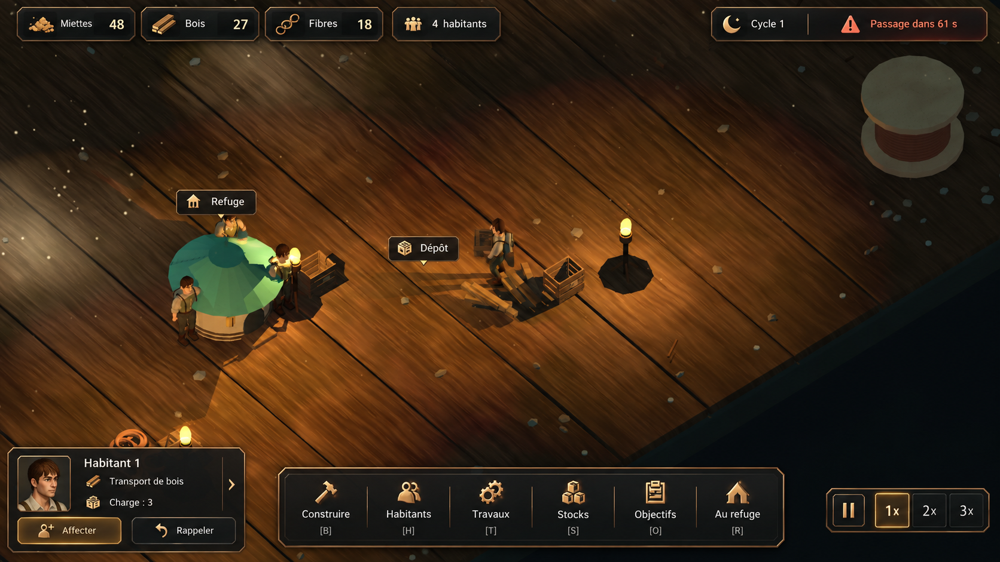
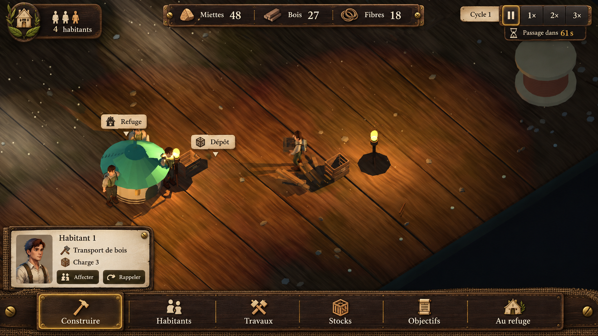
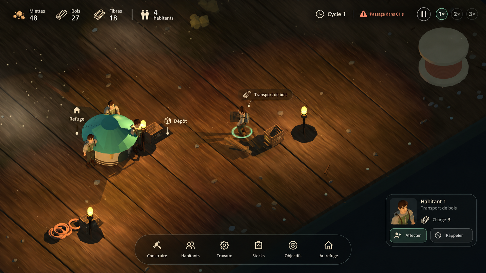
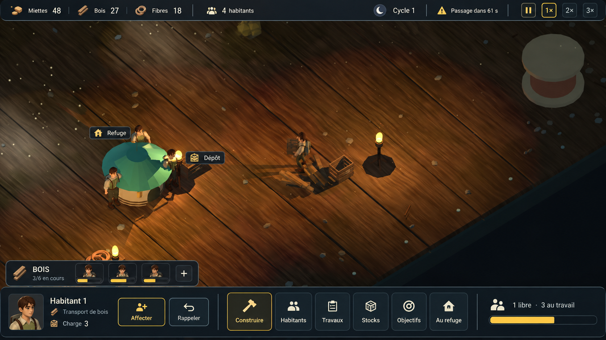
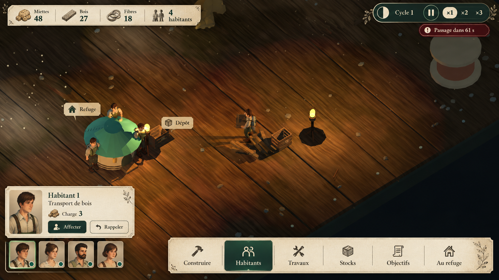

# Cinq propositions d’interface — Sous le Plancher

Maquettes visuelles générées avec l’outil ImageGen intégré, le 24 septembre 2026, à partir d’une capture du jeu. Aucune interface n’est encore implémentée. Les valeurs, portraits, icônes et raccourcis sont illustratifs et seront harmonisés lors de l’implémentation. Le numéro de version du modèle n’est pas exposé par l’outil.

Référence : `artifacts/delivery_06/to_storage.png`.

## 1. Cuivre et charbon



### Prompt de génération

```text
Use case: ui-mockup
Asset type: high-fidelity PC colony-management game screenshot, single landscape 16:9 image.
Input image: actual screenshot of the user's Godot game "Sous le Plancher", used as the background edit target.
Primary request: replace ALL the old interface and large world labels with a beautifully art-directed professional AAA-quality French game HUD. This is a visual UI proposal for a game about miniature humans living under a house floor.
Invariants: retain the SAME underlying 3D scene, isometric camera, miniature people, green-roof refuge at left, crates, wooden floor, large spool upper right, warm torches and dusty lighting. Do not redesign the game world or substitute a different game. Remove every original text, old top bar and bottom toolbar first; reconstruct only the background areas behind those UI elements.
UI information shared across designs: resources "Miettes 48", "Bois 27", "Fibres 18"; population "4 habitants"; time "Cycle 1"; a discreet alert "Passage dans 61 s"; playback pause, 1×, 2×, 3×; primary actions "Construire", "Habitants", "Travaux", "Stocks", "Objectifs", "Au refuge". A small contextual resident inspection shows a portrait of the same tiny human, "Habitant 1", "Transport de bois", "Charge 3", buttons "Affecter" and "Rappeler". Secondary small map labels "Refuge" and "Dépôt" if needed, never huge floating typography.
Quality: truly finished PC strategy game UI, exceptional typographic hierarchy, clear readable French text, consistent custom icons, precise alignment, generous rhythm within compact panels, restrained highlights, professional material shading, carefully differentiated selected/idle controls. A plausible implementable interface rather than a painting of interface.
Constraints: at least 75 percent of image remains unobstructed game world. NO large central window. No browser, desktop, phone, mockup frame, marketing headings, giant logo, watermark, numbered concept title or explanatory annotations. Only in-game UI. Exact French text; do not add meaningless microtext.
Distinct design direction:
Premium grounded survival strategy. Anthracite smoked-glass panels, narrow burnished copper borders, warm ivory typography, amber selected accents. Straight refined silhouettes with tiny chamfered corners, subtle depth, NOT generic rounded dashboard cards. Top-left three compact resource capsules on a narrow rail, top-right discreet time and danger strip. Elegant CENTERED bottom command dock around 55% screen width and 8% height, six beautiful copper engraved icons with short labels and keyboard hints. Bottom-left compact resident card 22% width and 15% height with portrait and cargo status. Bottom-right separate small playback controls. A confident polished restrained dark industrial aesthetic.
```

## 2. Atelier miniature



### Prompt de génération

```text
Use case: ui-mockup
Asset type: high-fidelity PC colony-management game screenshot, single landscape 16:9 image.
Input image: actual screenshot of the user's Godot game "Sous le Plancher", used as the background edit target.
Primary request: replace ALL the old interface and large world labels with a beautifully art-directed professional AAA-quality French game HUD. This is a visual UI proposal for a game about miniature humans living under a house floor.
Invariants: retain the SAME underlying 3D scene, isometric camera, miniature people, green-roof refuge at left, crates, wooden floor, large spool upper right, warm torches and dusty lighting. Do not redesign the game world or substitute a different game. Remove every original text, old top bar and bottom toolbar first; reconstruct only the background areas behind those UI elements.
UI information shared across designs: resources "Miettes 48", "Bois 27", "Fibres 18"; population "4 habitants"; time "Cycle 1"; a discreet alert "Passage dans 61 s"; playback pause, 1×, 2×, 3×; primary actions "Construire", "Habitants", "Travaux", "Stocks", "Objectifs", "Au refuge". A small contextual resident inspection shows a portrait of the same tiny human, "Habitant 1", "Transport de bois", "Charge 3", buttons "Affecter" and "Rappeler". Secondary small map labels "Refuge" and "Dépôt" if needed, never huge floating typography.
Quality: truly finished PC strategy game UI, exceptional typographic hierarchy, clear readable French text, consistent custom icons, precise alignment, generous rhythm within compact panels, restrained highlights, professional material shading, carefully differentiated selected/idle controls. A plausible implementable interface rather than a painting of interface.
Constraints: at least 75 percent of image remains unobstructed game world. NO large central window. No browser, desktop, phone, mockup frame, marketing headings, giant logo, watermark, numbered concept title or explanatory annotations. Only in-game UI. Exact French text; do not add meaningless microtext.
Distinct design direction:
Premium tactile Borrowers-inspired interface fabricated from tiny salvaged materials: dark stained wood, tightly woven linen inset, thin aged brass fasteners, tasteful cream paper labels. Elegant believable craft, not children's scrapbook or excessive distressed fantasy ornaments. Layout: top-center slim resource ledger 50% width; top-left tiny colony crest and population; time controls top-right. Bottom FULL-WIDTH but very shallow workshop tool rail 9% screen height with SIX carefully sculpted miniature tool icons and labels, organized in distinct functional groups. Selected resident card rises from the left end of rail, width 23% height 13%, paper tag with portrait and task. Rich handcrafted identity with clean highly legible contemporary typography.
```

## 3. Clair-obscur



### Prompt de génération

```text
Use case: ui-mockup
Asset type: high-fidelity PC colony-management game screenshot, single landscape 16:9 image.
Input image: actual screenshot of the user's Godot game "Sous le Plancher", used as the background edit target.
Primary request: replace ALL the old interface and large world labels with a beautifully art-directed professional AAA-quality French game HUD. This is a visual UI proposal for a game about miniature humans living under a house floor.
Invariants: retain the SAME underlying 3D scene, isometric camera, miniature people, green-roof refuge at left, crates, wooden floor, large spool upper right, warm torches and dusty lighting. Do not redesign the game world or substitute a different game. Remove every original text, old top bar and bottom toolbar first; reconstruct only the background areas behind those UI elements.
UI information shared across designs: resources "Miettes 48", "Bois 27", "Fibres 18"; population "4 habitants"; time "Cycle 1"; a discreet alert "Passage dans 61 s"; playback pause, 1×, 2×, 3×; primary actions "Construire", "Habitants", "Travaux", "Stocks", "Objectifs", "Au refuge". A small contextual resident inspection shows a portrait of the same tiny human, "Habitant 1", "Transport de bois", "Charge 3", buttons "Affecter" and "Rappeler". Secondary small map labels "Refuge" and "Dépôt" if needed, never huge floating typography.
Quality: truly finished PC strategy game UI, exceptional typographic hierarchy, clear readable French text, consistent custom icons, precise alignment, generous rhythm within compact panels, restrained highlights, professional material shading, carefully differentiated selected/idle controls. A plausible implementable interface rather than a painting of interface.
Constraints: at least 75 percent of image remains unobstructed game world. NO large central window. No browser, desktop, phone, mockup frame, marketing headings, giant logo, watermark, numbered concept title or explanatory annotations. Only in-game UI. Exact French text; do not add meaningless microtext.
Distinct design direction:
Ultra-refined cinematic minimalist PC HUD, almost invisible chrome. Soft black-to-transparent local gradients, off-white fine icons and typography, one muted sage-green selection accent, no copper, no wood framing. Top-left a sparse two-line typography cluster of resources and inhabitants without individual boxes. Top-right cycle, danger and playback on a quiet thin horizontal line. Bottom-center six isolated ivory icons with small labels on a single very faint transparent pill only 45% screen width. At lower-right a narrow elegant resident portrait/status capsule with two tiny action buttons; no large panel. Small thin selection ring at resident feet and subtly tethered "Transport de bois" tag, preserve world visibility. Large comfortable negative space, refined magazine-like typography, high contrast legibility without heavy borders. This concept must visibly contain much less UI mass than other strategy HUDs.
```

## 4. Poste de commande



### Prompt de génération

```text
Use case: ui-mockup
Asset type: high-fidelity PC colony-management game screenshot, single landscape 16:9 image.
Input image: actual screenshot of the user's Godot game "Sous le Plancher", used as the background edit target.
Primary request: replace ALL the old interface and large world labels with a beautifully art-directed professional AAA-quality French game HUD. This is a visual UI proposal for a game about miniature humans living under a house floor.
Invariants: retain the SAME underlying 3D scene, isometric camera, miniature people, green-roof refuge at left, crates, wooden floor, large spool upper right, warm torches and dusty lighting. Do not redesign the game world or substitute a different game. Remove every original text, old top bar and bottom toolbar first; reconstruct only the background areas behind those UI elements.
UI information shared across designs: resources "Miettes 48", "Bois 27", "Fibres 18"; population "4 habitants"; time "Cycle 1"; a discreet alert "Passage dans 61 s"; playback pause, 1×, 2×, 3×; primary actions "Construire", "Habitants", "Travaux", "Stocks", "Objectifs", "Au refuge". A small contextual resident inspection shows a portrait of the same tiny human, "Habitant 1", "Transport de bois", "Charge 3", buttons "Affecter" and "Rappeler". Secondary small map labels "Refuge" and "Dépôt" if needed, never huge floating typography.
Quality: truly finished PC strategy game UI, exceptional typographic hierarchy, clear readable French text, consistent custom icons, precise alignment, generous rhythm within compact panels, restrained highlights, professional material shading, carefully differentiated selected/idle controls. A plausible implementable interface rather than a painting of interface.
Constraints: at least 75 percent of image remains unobstructed game world. NO large central window. No browser, desktop, phone, mockup frame, marketing headings, giant logo, watermark, numbered concept title or explanatory annotations. Only in-game UI. Exact French text; do not add meaningless microtext.
Distinct design direction:
Serious high-end management and logistics strategy UI. Desaturated midnight blue/slate, ivory text, muted safety-yellow active state, precise thin dividers, clean squared modules, modern compact technical sans typography, NOT sci-fi neon. Top FULL-WIDTH shallow 4% height status strip with resources left and time/danger right. Bottom 12% height command ribbon split into three exact zones: left compact resident portrait and task/charge with Affecter/Rappeler; center six clear icon actions in a horizontal row; right population availability "1 libre · 3 au travail" and time speed buttons. A narrow contextual small work-orders strip immediately ABOVE bottom-left ribbon: "BOIS" and three neat worker portrait slots with a progress bar; no giant spreadsheet and no sidebar. Clear hierarchy, information density done elegantly, polished readable management workflow. All controls concentrated near bottom to leave map open.
```

## 5. Carnet du refuge



### Prompt de génération

```text
Use case: ui-mockup
Asset type: high-fidelity PC colony-management game screenshot, single landscape 16:9 image.
Input image: actual screenshot of the user's Godot game "Sous le Plancher", used as the background edit target.
Primary request: replace ALL the old interface and large world labels with a beautifully art-directed professional AAA-quality French game HUD. This is a visual UI proposal for a game about miniature humans living under a house floor.
Invariants: retain the SAME underlying 3D scene, isometric camera, miniature people, green-roof refuge at left, crates, wooden floor, large spool upper right, warm torches and dusty lighting. Do not redesign the game world or substitute a different game. Remove every original text, old top bar and bottom toolbar first; reconstruct only the background areas behind those UI elements.
UI information shared across designs: resources "Miettes 48", "Bois 27", "Fibres 18"; population "4 habitants"; time "Cycle 1"; a discreet alert "Passage dans 61 s"; playback pause, 1×, 2×, 3×; primary actions "Construire", "Habitants", "Travaux", "Stocks", "Objectifs", "Au refuge". A small contextual resident inspection shows a portrait of the same tiny human, "Habitant 1", "Transport de bois", "Charge 3", buttons "Affecter" and "Rappeler". Secondary small map labels "Refuge" and "Dépôt" if needed, never huge floating typography.
Quality: truly finished PC strategy game UI, exceptional typographic hierarchy, clear readable French text, consistent custom icons, precise alignment, generous rhythm within compact panels, restrained highlights, professional material shading, carefully differentiated selected/idle controls. A plausible implementable interface rather than a painting of interface.
Constraints: at least 75 percent of image remains unobstructed game world. NO large central window. No browser, desktop, phone, mockup frame, marketing headings, giant logo, watermark, numbered concept title or explanatory annotations. Only in-game UI. Exact French text; do not add meaningless microtext.
Distinct design direction:
Distinct literary colony-survival art direction: warm pale ivory thin parchment surfaces, deep forest green text, muted burgundy alert, charcoal engraved illustrative icons, editorial serif headings paired with precise clean sans numerals. Luxurious restrained bookbinding and ink aesthetic, NOT brown medieval RPG bar, not ornate fantasy. Top-left three little horizontal ledger entries for resources on one ivory slip, top-right compact dark green cycle/time medallion and playback. Bottom asymmetrical interface: a short four-resident PORTRAIT RAIL at lower left, chosen portrait opens a small ivory paper resident card just above it, no larger than 21% width 14% height. Main six-action dock anchored bottom RIGHT spanning 60% width, pale ivory paper ribbon with etched icons and dark green selected tab "Habitants". Tiny restrained corner stitching, thin ink lines, beautifully typeset. Bright small UI surfaces contrast the dark wood scene while at least 78% of game world stays unobstructed.
```


